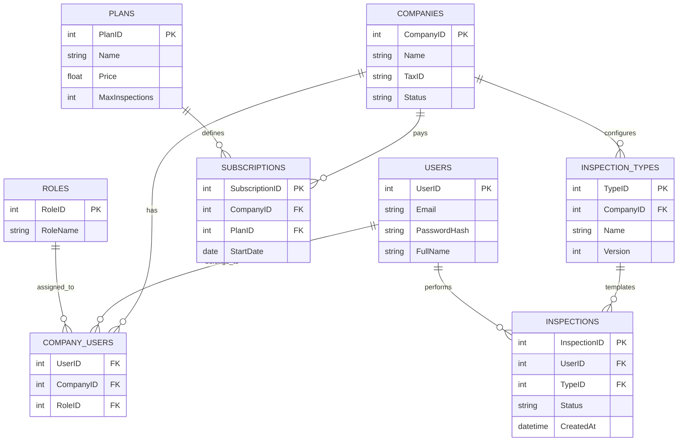

# Relational Modeling (SQL) - Structure and Normalization

This document outlines the architecture of the relational database for InspectaPro. This model manages structured, stable, and highly relational data, ensuring auditability and historical traceability as required by the business model.

## 1. Research: Normalization and Referential Integrity

### Normalization (1NF, 2NF, 3NF)

To ensure a robust structure and avoid data anomalies, we applied the first three normal forms:

- **First Normal Form (1NF):** We eliminated repeating groups and ensured all fields contain atomic values. Each table has a unique Primary Key (PK).
- **Second Normal Form (2NF):** We ensured that all non-key attributes are fully functionally dependent on the primary key, removing partial dependencies.
- **Third Normal Form (3NF):** We eliminated transitive dependencies. For example, Plan details are stored in the `Plans` table and referenced via ID, rather than being duplicated in the `Subscriptions` table.

### Referential Integrity and Redundancy

- **Integrity:** Through Foreign Keys (FK), we guarantee that every inspection is linked to a valid `User` (Technician) and `Company`.
- **Redundancy Control:** Normalization ensures that administrative data (like User names or Company tax IDs) is stored in one place, maintaining a single source of truth.

## 2. Entity Definition and Attributes

| Table                | Main Attributes                                             | Business Purpose                                                                 |
| :------------------- | :---------------------------------------------------------- | :------------------------------------------------------------------------------- |
| **Companies**        | `CompanyID (PK)`, `Name`, `TaxID`, `Status`                 | Represents the organizational entity and customer.                               |
| **Users**            | `UserID (PK)`, `Email`, `PasswordHash`, `FullName`          | Internal users (Admins and Technicians).                                         |
| **Roles**            | `RoleID (PK)`, `RoleName`                                   | Defines roles like Company Administrator or Technician.                          |
| **Company_Users**    | `UserID (FK)`, `CompanyID (FK)`, `RoleID (FK)`              | Supports the N:M relationship where users can have roles in different companies. |
| **Plans**            | `PlanID (PK)`, `Name`, `Price`, `MaxInspections`            | Service tiers for the SaaS subscription model.                                   |
| **Subscriptions**    | `SubscriptionID (PK)`, `CompanyID (FK)`, `PlanID (FK)`      | Tracks active service access for each Company.                                   |
| **Inspection_Types** | `TypeID (PK)`, `CompanyID (FK)`, `Name`, `Version`          | Form templates created by the Admin.                                             |
| **Inspections**      | `InspectionID (PK)`, `TypeID (FK)`, `UserID (FK)`, `Status` | Tracks the lifecycle: Created, Assigned, and Closed.                             |

## 3. Relational Logic and Lifecycle Support

The SQL model is responsible for the **control and configuration** stages of the inspection lifecycle:

1. **Registration & Roles:** Handled by `Users`, `Roles`, and `Company_Users`.
2. **Creation & Assignment:** The `Inspections` table records which Technician is responsible for which activity.
3. **Traceability:** The `Status` field (Draft, Assigned, Completed, Closed) ensures historical consistency for audits.

**The Bridge to NoSQL:** The `InspectionID` serves as the shared identifier. While SQL manages the "Who, When, and Status," the dynamic results (questions and evidence) are stored in the NoSQL document referenced by this ID.

