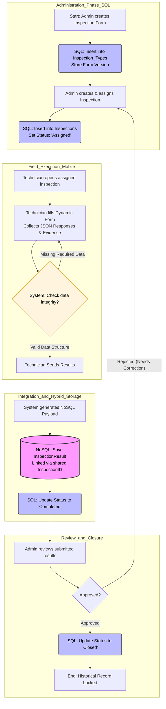

# Process Flow Diagram - InspectaPro

This document details the operational and technical flow of the system. It demonstrates the integration between the **Relational Model (SQL)** for administration and the **Document Model (NoSQL)** for dynamic results, following the business lifecycle and actors defined in the Business Interpretation.

## 1. Integrated Inspection Lifecycle

The following flow illustrates how data moves through the system, the specific database actions, and the automated validations performed by the **System** actor.

## 2. Technical Integration Points

### 2.1 The Shared Identifier (SQL ↔ NoSQL)

The core of this integration is the Shared ID Strategy:

- Source: The InspectionID (Primary Key) is generated in the SQL Inspections table.
- Destination: This exact ID is stored as inspectionSqlId in the NoSQL Document created by Mateo.
- Purpose: This link allows the system to query the administrative "Who/When" from SQL and the dynamic "Results/Evidence" from NoSQL in a single view.

### 2.2 System Validations

As defined in the business interpretation, the System actor performs automated checks:

- Form Versioning: When an inspection is created, the system locks it to the current Version found in the SQL Inspection_Types table.
- Data Integrity: Before the NoSQL document is finalized, the system validates that the technician's answers match the expected data types (e.g., numeric, boolean, or evidence links).

### 2.3 Status Transitions

The SQL Status field manages the state machine of the business process:

- Assigned: Inspection is ready for the technician.
- Completed: NoSQL document has been successfully stored.
- Closed: Administrator has reviewed and locked the record for historical audit.

## 3. Data Consistency Considerations

To ensure high-level traceability, the system implements a Synchronous Update:

- The SQL record status only changes to Completed after the NoSQL database confirms the document has been successfully written.
- This prevents "orphan" records where an inspection appears finished in the dashboard but contains no actual data.
